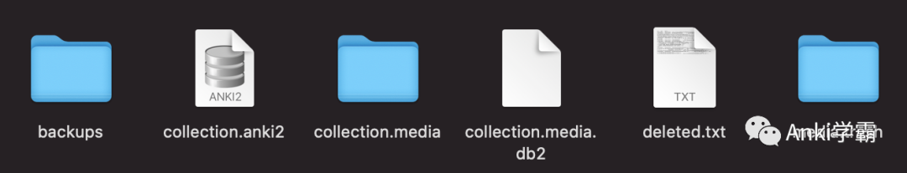

Anki的每个collection会使用到6个文件或文件夹

- collection.anki2
- deleted.txt
- collection.media
- collection.media.db2
- media.trash
- backups

**collection.anki2**

- 一个sqlite数据库文件
- 所有配置、卡片等信息都保存在这个文件
- 有很多张表，包括但不限于：
  - deck - deck表
  - col - collection表
  - config - collection配置表
  - deck_config - deck配置表
  - cards - 卡片表
  - notetypes - note类型表
  - 可以使用DB Browser for SQLite打开

**deleted.txt**

- 一个文本文件
- 一般的编辑器都能直接打开
- 有三个字段
  - nid
    - note ID，即唯一标识
    - 因为Anki不支持删除单张卡片，只支持删除note，所以只记录了note ID
  - mid
    - note类型ID
  - fields
    - note各字段的内容
    - 误删的note可从这个文件中找回

**collection.media**

- 一个文件夹
- 保存了所有卡片用到的媒体文件，例如图片、音视频等
- 如果媒体文件很多，磁盘读写慢，导入或导出collection会耗时较久，尤其是导入
- 如果频繁使用媒体文件，这个文件夹通常是最大的

**collection.media.db2**

- 一个sqlite数据库文件
- 作用与collection.anki2类似，但主要用来管理媒体文件
- 只有两张表
  - media - 媒体文件记录表
  - meta - 元信息表

**media.trash**

- 一个文件夹
- 保存了所有删除的媒体文件
- 通过Tools -> Check Media -> Delete Unused操作，将媒体文件从collection.media转移到此文件夹
- 通过Tools -> Check Media -> Restore Deleted操作，将媒体文件从此文件夹转移到collection.media
- 通过Tools -> Check Media -> Empty Trash将其清空

**backups**

- 一个文件夹
- 保存了所有备份的.colpkg文件
- 文件名包含了日期和时间，类似于backup-2022-05-10-07.34.17.colpkg
- 可自动生成，2.1.50+版本可通过File -> Create Backup手动生成
- 生成频率和数量可通过Preferences -> Backup调整