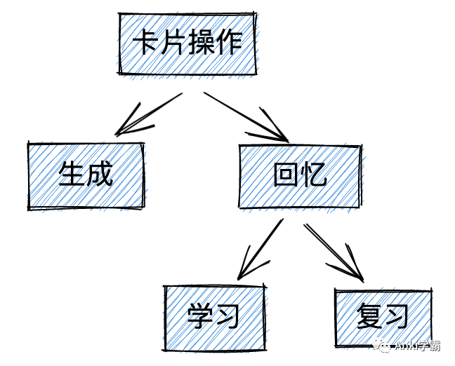
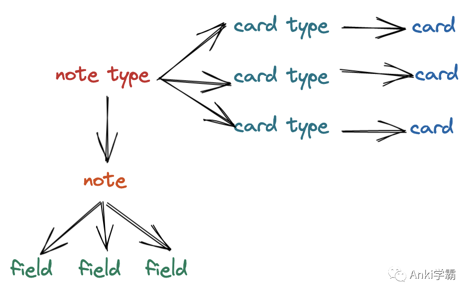
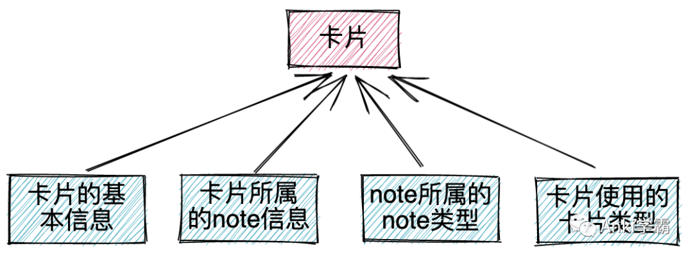

我们对于卡片的操作，大体可以分为两种：

- 生成卡片
- 回忆卡片

生成卡片，指的是输入字段内容后生成一张或多张新卡片。

根据[Anki学习中卡片间隔的处理方式](Anki学习中卡片间隔的处理方式.md)，学习也是回忆的过程，所以学习和复习卡片可以统称回忆卡片。

生成和回忆卡片的单位不同

-  生成卡片的单位是note
- 回忆卡片的单位是卡片
- 一个note可能包含一张或多张卡片

严格来说，并不存在“制作卡片”一说

-  卡片非由我们直接制作出来，而是由Anki自动生成
- 并没有一个独立的对象记录卡片的“完整信息”，而是由Anki动态生成
- Anki所知的是一些配置和我们输入的内容

通常所说的“制作卡片”，实际上是在制作note，更准确地说，是在填充note字段。

卡片的动态生成所需的“原料”如下：

-  卡片的基本信息
- 卡片所属的note信息
- note所属的note类型
- 卡片使用的卡片类型

可以认为，卡片的本质就是由以上四种数据动态生成的对象。

