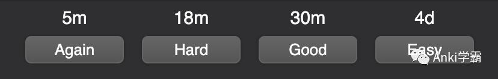
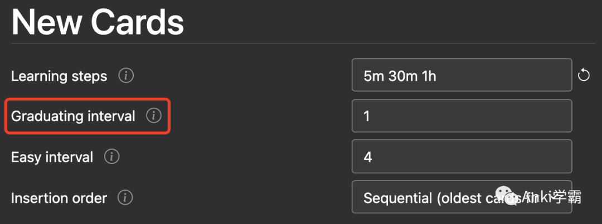
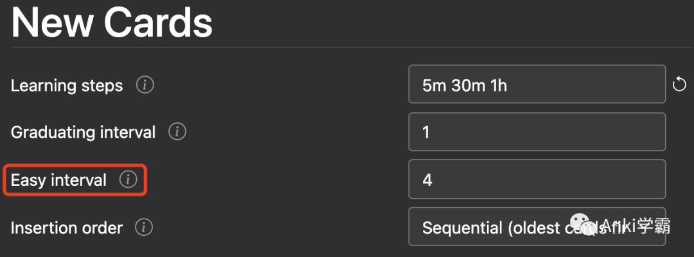

以下分析说明基于v3版本的调度器。

我们知道，[Anki卡片的种类](http://mp.weixin.qq.com/s?__biz=MjM5OTQ2NDU2Mw==&mid=2247484335&idx=1&sn=a2ca2297945b929b822d731b548ec413&chksm=a73a58b3904dd1a53e3716679bb6551677acfb33e5b203e13fc48b0a45af6bcedaf4a27a3a55&scene=21#wechat_redirect)主要有四种。从调度角度看，最复杂的大概就是“学习中卡片”。

每张学习中卡片都有两个重要的属性

- 剩余的step数
- 下次显示的时间间隔

与复习卡片一样，学习中卡片也有四个按钮，表示回忆答案的难易程度：

- Again
- Hard
- Good
- Easy

**Again**

- 无论学习中卡片处于第几个step，Again都会将卡片重置到第一个step
- 只有选择了Again，配置的第一个step才会用上
- 假设配置的steps为5m 30m 1h，Again的效果便是让卡片在5分钟之后显示
- 对于较难记忆的知识点，例如复杂的概念或公式，学习中卡片频繁使用Again属正常操作

**Hard**

- Anki对于Hard的处理分两种情况，第一个step和非第一个step
- 如果是第一个step，即第一次显示，Hard的值是前两个step的平均值向上取整。所以对于配置5m 30m 1h，第一个step上的Hard值会是(30+5)/2约等于18分钟
  
- 如果不是第一个step，则Hard将是上一个step的值，即再次按照上次的间隔重复一遍。所以对于配置5m 30m 1h，1h这个step上的Hard值会是30分钟

**Good**

- Good会简单地将卡片向前移动到下一个step

- 如果当前是最后一个step，Good将卡片变成复习卡片，用Anki的术语说就是这张卡片“毕业”（graduate）了

- 毕业的卡片默认1天后即明天显示，可通过Graduating interval配置项调整

  

**Easy**

- Easy会跳过剩余的step，直接将学习中卡片变成复习卡片

- 通过Easy毕业的卡片，默认4天后显示，可通过Easy interval配置项调整

  

- 非常简单的卡片或冗余的卡片通常可以直接使用Easy

值得注意的是，无论是哪一个选项，计算下一个step的间隔时长时，Anki都会加几分钟随机数进去，以避免卡片的集中显示，所以下一个step的间隔时长可能并不与配置的值严格一致。