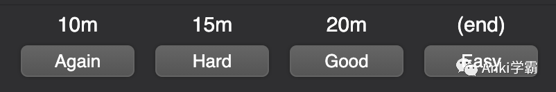

# 一张Anki卡片的N种状态

- 整体上，一张Anki卡片有“正常”和“筛选”两种状态。
- 如果卡片经过筛选条件，被放入了筛选Deck，则处于“筛选”状态，否则都处于“正常”状态。
- ## “正常”状态
- "正常"状态下的卡片，又可以分为以下4个子状态，每个子状态对应了卡片生命周期的不同阶段：
	- “新”状态
	- “学习中”状态
	- “复习”状态
	- “重学中”状态
- ### “新”状态
	- 顾名思义，这是所有卡片的原始状态。
	- 只有“新”状态下的卡片，才有“位置”这一属性。
	- “位置”用来决定新卡片的显示顺序，可通过查看其在Browser中的Due字段确认它的值，格式是`New #123`。
- ### “学习中”状态
	- “学习中”状态是“新”状态的下一个状态，新卡片一旦显示出来便默认进入此状态。
	- “学习中”状态的卡片只有两个重要的属性，剩余步骤数和被调度的间隔时长。
	- 剩余步骤数的计算依据有两个
		- 回答卡片时选择的难易程度
		- Deck配置 -> New Cards -> Learning steps
	- 只有在回答Again和Good时，才会去计算剩余步骤数，Hard会使剩余步骤数保持不变，而Easy则直接将卡片推进到“复习”状态，感兴趣的同学可以阅读[Anki学习中卡片间隔的处理方式​](Anki学习中卡片间隔的处理方式​.md)这篇文章。
- ### “复习”状态
	- 持续使用Anki一段时间后，“复习”状态是绝大多数卡片应处于的状态，也是间隔重复算法发挥作用的阶段。
	- 为了应用间隔重复算法，卡片处于“复习”状态时会拥有更多的属性，例如：
		- 上次回答后计算出的到期日期
		- 当前col的创建天数
		- 间隔因子
		- 遗忘次数
		- 遗忘次数是否超过了阈值
	- “复习”状态下，卡片每个属性的作用较复杂，后面单独撰文说明。
- ### “重学中”状态
	- 卡片处于“重学中”状态时，处理方式与“学习中”状态基本相同。
	- 每次卡片从“复习”状态进入“重学中”状态，遗忘次数就会增加一次。
- ## “筛选”状态
- 卡片被放入筛选Deck中便进入“筛选”状态，有两个子状态
	- “预览”状态
	- “重新调度”状态
- ### “预览”状态
	- “预览”状态，顾名思义不会对卡片的调度产生任何影响，仅供浏览。
	- 创建筛选Deck时，不勾选Reschedule cards based on my answers in this deck，筛选出的卡片便是“预览”状态。
	- 因为不需要按照正常的间隔调度算法进行调度，所以它的调度间隔是固定的，如下：
		- Again - 600秒即10分钟后再次显示
		- Hard - 900秒即15分钟后再次显示
		- Good - 1200秒即20分钟后再次显示
		- Easy - 放回原Deck，表示预览结束，不再显示
  		
		  

- ### “重新调度”状态
	- 与“预览”状态相反，“重新调度”状态的卡片会按照正常的调度算法进行调度。
	- 创建筛选Deck时，勾选Reschedule cards based on my answers in this deck，筛选出的卡片便是“重新调度”状态。
	- “重新调度”状态下的卡片被回答时，会按照卡片在原Deck中的方式进行调度，也就是所有调度相关的配置都与原Deck相同。