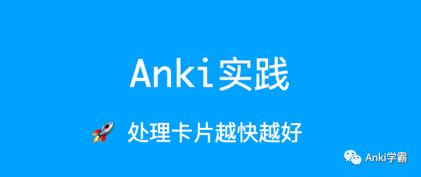

何为快速处理Anki卡片

- 指的是看到问题之后要在最短的时间内想出答案
- 根据文档提示，加上个人经验，看到问题到想出答案的时间控制在10秒内为佳
- 较长的概念、音频、图片cloze等，处理时间或许不可避免的较长，也应尽量压缩

快速处理卡片对学习者的要求

- 集中注意力
- 主动快速地思考问题的含义
- 主动快速地检索回忆

快速处理卡片的好处

- 平时养成快速回忆的习惯，用到知识时便能快速提取

  - 使用间隔重复记忆知识的目的，就是为了在运用的时候能毫不费力地提取
  - 只有通过有间隔地大量重复，才能做到让知识变得随取随用
  - 经常用到的“热点知识”，直接拿来思考而不用翻阅笔记工具

- 如果每天处理大量卡片，可节约很多时间

  - 每张卡片节约几秒，总体可能节约几十分钟
  - 300张卡片，每张15秒耗时75分钟，每张10秒耗时50分钟
  - 每张卡片节约5秒，300张总体节约25分钟

- 锻炼自己集中注意力的能力

也要注意欲速则不达

- 快速是为了形成快速回忆的习惯，不是为快而快
- 看清问题，避免看到问题A，想到了与之相似的问题B的答案
- 确保自己想出了答案，有难度就选Hard，没想出就选Again

Anki卡片包含的知识点间存在关联很有好处，然而

- Anki的主要作用是记忆知识，并非管理知识
- 知识间的关联应该使用外部的笔记工具去做
- 将知识关联通常是一个耗时的体力活，甚至有时候还要靠灵感
- 快速处理卡片时不必思考卡片包含的知识点间的关联